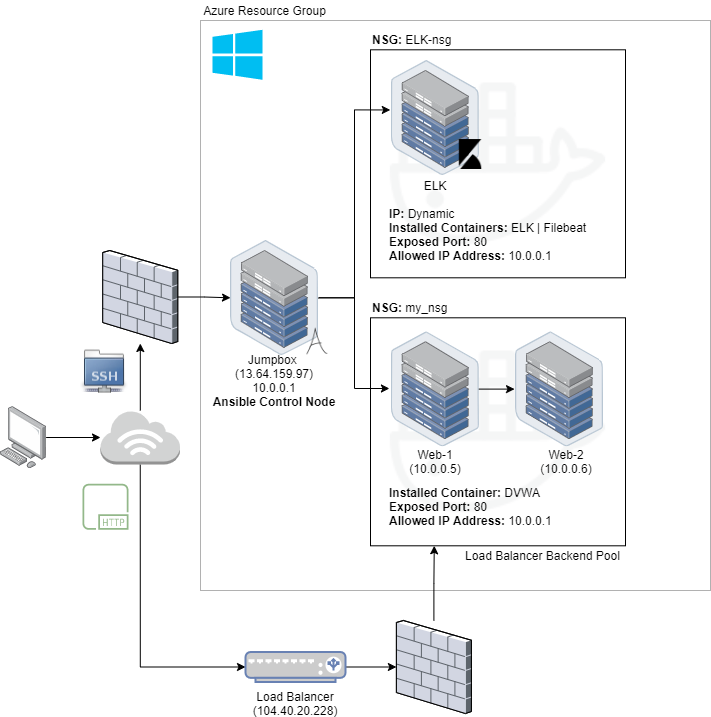
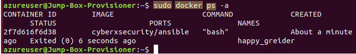

## Automated ELK Stack Deployment

The files in this repository were used to configure the network depicted below.

These files have been tested and used to generate a live ELK deployment on Azure. They can be used to either recreate the entire deployment pictured above. Alternatively, select portions of the YAML file may be used to install only certain pieces of it, such as Filebeat.

    ---
      - name: Configure Elk VM with Docker
      hosts: elk
      remote_user: sysadmin
      become: true
      tasks:
        # Use apt mobulde
        - name: Install docker.io
          apt:
           update_cache: yes
            name: docker.io
            state: present

        # Use apt module
        - name: Install pip3
          apt:
            force_apt_get: yes
            name: python3-pip
            state: present

        # Use pip module
        - name: Install Docker python module
          pip: 
            name: docker
            state: present

        # Use sysctl module
        - name: Use more memory
          sysctl:
            name: vm.max_map_count
            value: "262144"
            state: present
            reload: yes

        # Use docker_container module
        - name: download and launch a docker elk container
          docker_container:
            name: elk
            image: sebp/elk:761
            state: started
            restart_policy: always
            published_ports:
              - 5601:5601
              - 9200:9200
              - 5044:5044

        # Use systemd module
        - name: Enable service docker on boot
          systemd:
            name: docker
            enabled: yes`

This document contains the following details:
- Description of the Topology
- Access Policies
- ELK Configuration
  - Beats in Use
  - Machines Being Monitored
- How to Use the Ansible Build

### Description of the Topology

The main purpose of this network is to expose a load-balanced and monitored instance of DVWA, the D*mn Vulnerable Web Application.

Load balancing ensures that the application will be highly available, in addition to restricting access to the network.
- Using the off-loading function of a load balancer alls an organization to defend against DDoS attacks. It's able to do this by shifting attack traffic from one server to another.
- The advantage of the jumpbox reduces the attack surface exposed to the internet. It's a secure computer that the admin would need to connect to before launching any administrative tasks or connect to the load balancer or other servers.

Integrating an ELK server allows users to easily monitor the vulnerable VMs for changes to the jumpbox and system network.
- Filebeat monitors the log files and log events of the two web servers and forwards them to Elasticsearch.
- Metricbeat collects system metrics from systems and services to help you monitor their overall health and any anomalies that may occur.

The configuration details of each machine may be found below.

| Name          | Function                       | IP Address    |  Operating System | Installed Containers |
|---------------|--------------------------------|---------------|-------------------|----------------------|
| Jump Box      | Gateway / Ansible Control Node | 10.0.0.1      |  Linux            |                      |
| ELK           | ELK Stack with Filebeat        | Dynamic       |  Ubuntu           | ELK / Filebeat       |
| Load Balancer | Load Balancer                  | 104.40.20.228 |                   |                      |
| Web 1         | DVWA Application               | 10.0.0.5      |  PHP/MySQL        | DVWA                 |
| Web 2         | DVWA Application               | 10.0.0.6      |  PHP/MySQL        | DVWA                 |

### Access Policies

The machines on the internal network are not exposed to the public Internet. 

Only the "Jump Box" machine can accept connections from the Internet. Access to this machine is only allowed from the following IP address:
- 72.223.12.157

Machines within the network can only be accessed by the Jumpbox (13.64.159.97).

A summary of the access policies in place can be found in the table below.

| Name          | Publicly Accessible | Allowed IP Address |
|---------------|---------------------|--------------------|
| Jump Box      | Yes                 | 72.223.12.157      |
| Load Balancer | Yes                 | 72.223.12.157      |
| ELK           | No                  | 10.0.0.1           |
| Web 1         | No                  | 10.0.0.1           |
| Web 2         | No                  | 10.0.0.1           |

### Elk Configuration

Ansible was used to automate configuration of the ELK machine. No configuration was performed manually, which is advantageous because Ansible is a powerful open-source tool. Which can be easy to setup, and allows you to model complex workflows without much effort.

The playbook implements the following tasks:
- Install Docker.io
- Install pip3
- Install Docker python module
- Download and launch a docker instance

The following screenshot displays the result of running `docker ps` after successfully configuring the ELK instance.

### Target Machines & Beats
This ELK server is configured to monitor the following machines:

| Name  | Server Monitored |
|-------|------------------|
| Web 1 | Yes              |
| Web 2 | Yes              |

We have installed the following Beats on these machines:
- Filebeat
- Metricbeat
- Packetbeat

These Beats allow us to collect the following information from each machine:
- Filebeat will collect data about the file system. This includes files changed, requested, and uploaded
- Metricbeat will collect data about the system itself. This includes uptime, and SSH logins. 
- Packetbeat will collect network data. This includes incoming and outgoing packets.

### Using the Playbook
In order to use the playbook, you will need to have an Ansible control node already configured. Assuming you have such a control node provisioned: 

SSH into the control node and follow the steps below:
- Copy the playbook file to Ansible Control Node.
- Update the hosts file to include the webserver and Elk.
- Run the playbook, and navigate to Kibana (http://[Host IP]:5601/app/kibana#/home) to check that the installation worked as expected.
- Copy the playbook file to the Ansible Control Node. 
        
      $ cd /etc/ansible
      $ mkdir files
      # Clone Repository
      $ git clone https://github.com/chrisecurity/Ansible-DVWA-ELK-Stack-Project.git
      # Move Playbooks and hosts file Into `/etc/ansible`
      $ cp /Ansible-DVWA-ELK-Stack-Project/ReadMe/Playbooks/*
            
- Playbooks for [Filebeat](Ansible/install-filebeat.yml) and [Metricbeat](Ansible/install-metricbeat.yml) can be found here.
- Copy the install-ELK.yml file to /etc/ansible/roles/install-ELK.yml
- Edit the hosts file to specify which machine to run the Ansible Playbook on. A copy of the hosts file can be seen below

      [elk]
      10.1.0.4 ansible_python_interpreter=/usr/bin/python3

      [webservers]
      10.0.0.5 ansible_python_interpreter=/usr/bin/python3
      10.0.0.6 ansible_python_interpreter=/usr/bin/python3

- Run the Ansible Playbook and install the ELK server. 

      cd /etc/ansible
      $ ansible-playbook install-ELK.yml elk
      $ ansible-playbook install-filebeat.yml webservers
      $ ansible-playbook install-metricbeat.yml webservers`

- To ensure the ELK server is running navigate to http://[Host IP]:5601/app/kibana#/home

### A few notes
- To download the playbook you can use the following command:
`curl https://github.com/chrisecurity/Ansible-DVWA-ELK-Stack-Project/Ansible/install-ELK.yml > /etc/ansible/roles/install-ELK.yml`
- To run the Playbook you'll need to use the following command:
`ansible-playbook /etc/ansible/roles/install-ELK.yml`
- To check that your installation is working you'll need to navigate to the following url:
`http://[your_elk_server_ip]:5601/app/kibanan`
